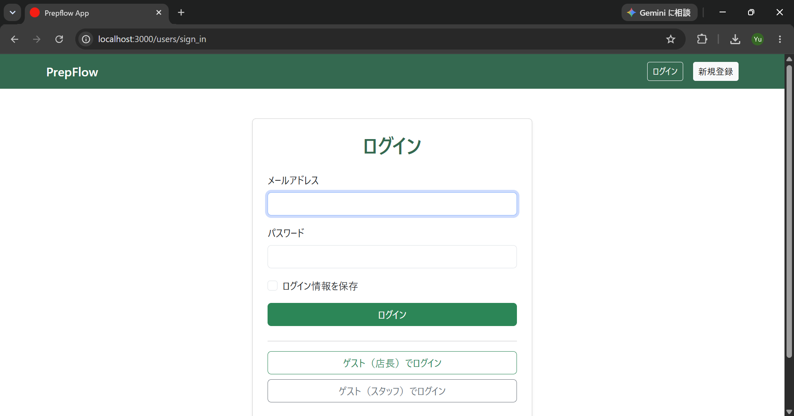
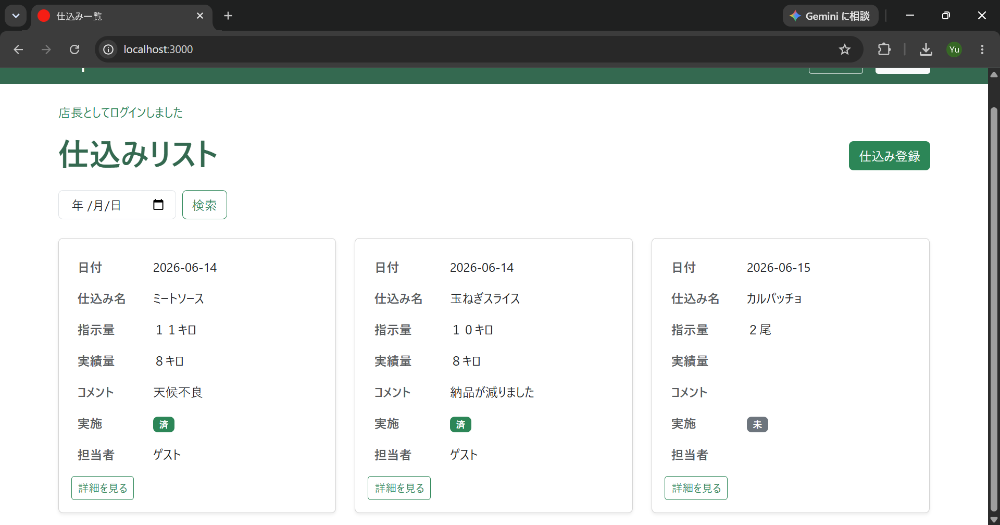
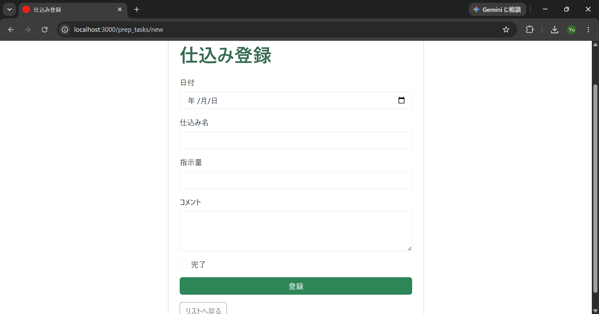
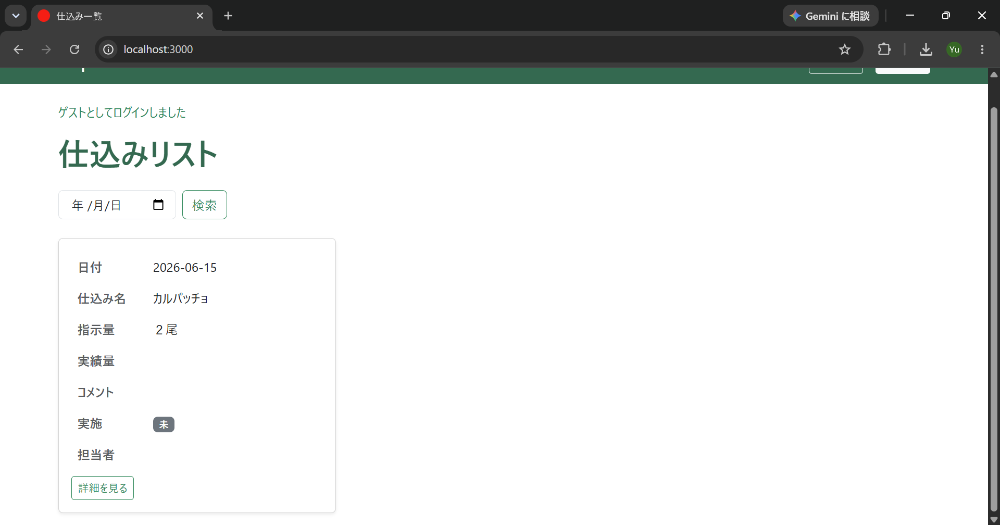
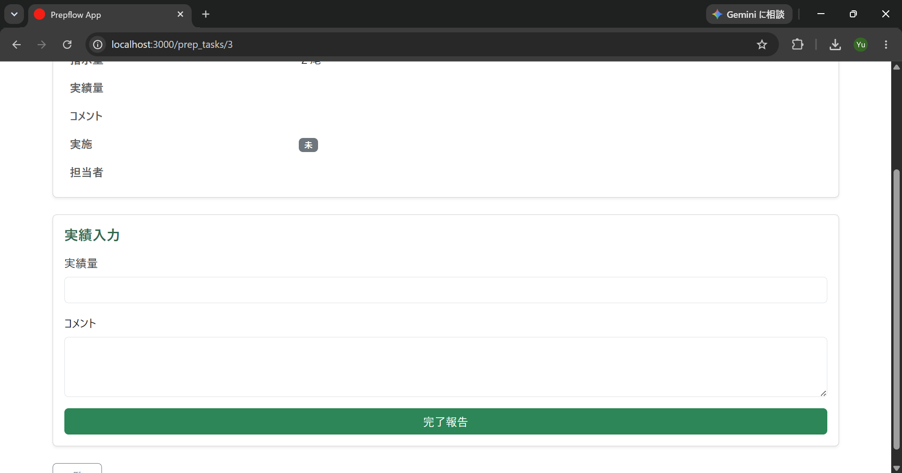
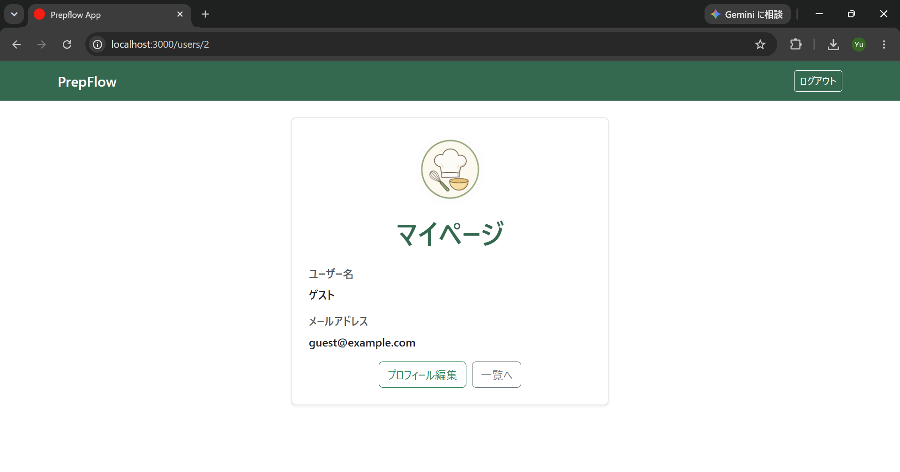
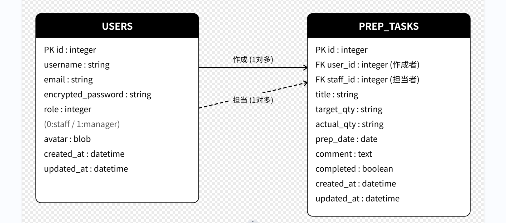

# PrepFlow

飲食店向けの仕込み指示・実績管理アプリ

---

## アプリの概要

店長がスタッフへ仕込み指示を登録し、スタッフが実績量やコメントを入力することで、仕込み状況をリアルタイムで可視化するWebアプリケーションです。

---

## スクリーンショット

| ログイン画面 | 仕込みリスト（店長） |
|------------|------------------|
|  |  |

| 仕込み登録画面 | 仕込みリスト（スタッフ） |
|-------------|----------------------|
|  |  |

| 完了報告画面 | マイページ |
|------------|----------|
|  |  |

---

## アプリの使い方

### 店長（manager）
1. ログイン後、仕込みリストから「仕込み登録」で新しい仕込みを作成
2. 日付・仕込み名・指示量を入力して登録
3. スタッフの実績・コメントを一覧から確認
4. 必要に応じて編集・削除

### スタッフ（staff）
1. ログイン後、仕込みリストから担当する仕込みを選択
2. 実績量・コメントを入力して「完了報告」
3. 完了した仕込みは一覧から自動で非表示

### ゲストログイン
- 「ゲスト（店長）でログイン」→ 店長機能を確認
- 「ゲスト（スタッフ）でログイン」→ スタッフ機能を確認

---

## なぜこれを作ったか

飲食店では仕込み指示や実績の共有を紙や口頭で行うことが多く、以下のような課題がありました。

- 営業状況によって仕込み量が変更されることがあるが、その理由が共有されない
- 店長とスタッフ間で仕込み状況が可視化されていない
- 紙の指示書は管理が煩雑で、実績の振り返りが難しい

これらの課題を解決するために、仕込み指示と実績をデジタルで一元管理できるアプリを開発しました。

---

## 工夫したところ

### 権限制御（role管理）
店長とスタッフでできる操作を分けることで、誤操作を防ぎます。

- 店長のみ：仕込みの作成・編集・削除
- スタッフのみ：実績量・コメントの入力・完了報告

### 完了済み仕込みの自動非表示
Railsのスコープ機能を使い、スタッフの一覧画面では完了済みの仕込みを自動で非表示にしています。

```ruby
scope :incomplete, -> { where(completed: false) }
```
### Turbo Streamsによる非同期処理
完了報告後にページリロードなしで仕込みカードが一覧から消えるようTurbo Streamsを実装しました。また一覧画面から実績量・コメント・完了報告まで完結できる仕様に変更し、現場スタッフが忙しい中でも使いやすさを意識した設計にしました。

### 1人目登録で自動的に店長になる
`before_create` コールバックを使い、最初に登録したユーザーが自動的に店長権限を持つ設計にしています。

### ゲストログイン機能
面接官や閲覧者がアカウント登録なしにすぐ全機能を確認できるよう、店長・スタッフそれぞれのゲストログイン機能を実装しました。

---

## ER図



---

## 使用技術

| カテゴリ | 技術 |
|---------|------|
| バックエンド | Ruby on Rails 8.1 |
| フロントエンド | Bootstrap 5.3 |
| 認証 | Devise |
| データベース | SQLite3 |
| 画像アップロード | ActiveStorage |

---

## セットアップ

```bash
git clone https://github.com/your_username/prepflow_app.git
cd prepflow_app
bundle install
rails db:create db:migrate db:seed
rails s
```

ゲストログインはトップページから利用できます。
